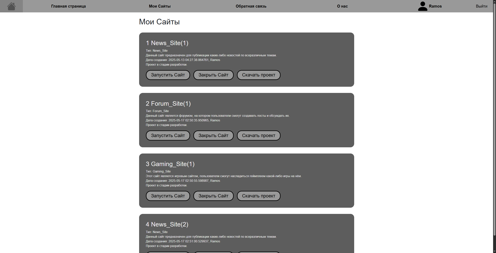
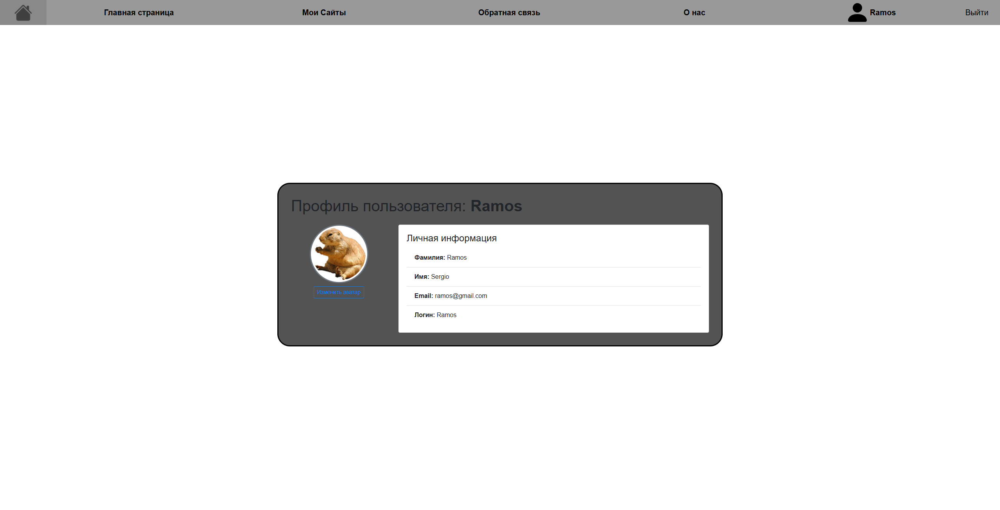

Сайт по продаже сайтов.
Проектом занимаются Макар К. и Сергей К.  

# Site for Selling Sites #  

Сайт, продающий разные шаблоны сайтов и дающий возможность связи с разработчиком. Пользователю будут презентованы шаблоны некоторых сайтов,
относительно которых покупатель сможет сделать выбор - подходит ли такой вариант сайта для него, или нет. 
*Сайт написан на Flask.* 

## Описание 
- На всех страницах сайта сверху будет расположена навигационная панель, благодаря
которой пользователь сможет удобно перемещаться между страницами сайта.
- На первой странице сайта будет расположена презентация этого сайта.

<br>


- На главной странице сайта будут расположены виджеты,
каждый из которых будет представлять какой-то определенный вид сайта.


- Также на сайте будут такие страницы как: 
  страница с "Моими сайтами" 


  (в ней пользователь сможет просмотреть все свои купленные сайты: в какой стадии разработки находятся,
  как на данный момент работают и выглядят, а также сможет скачать файлы каждого проекта),
  страница с "Обратной связью" (в ней пользователь сможет задачать вопросы чат-боту нашего сайта,
  или задать вопросы разработчику по конкретному купленному сайту)


- Также пользователь может задать какие-либо вопросы чат-боту.


# На сайте реализована работа с аккаунтами пользователей:
1) Регистрация
  


2) Авторизация


3) У каждого пользователя есть свой личный кабинет, где он может просмотреть личную информацию.
  


- Реализована работа с базой данных, в которой хранятся данные о пользователях, а также имя их личного каталога
на сервере, в котором хранятся данные их сайтов.
- Пользователь в любой момент может просмотреть в каком состоянии находится его сайт:
  на каком этапе разработки он находится и как он работает и выглядит.
  (Пользователь может непосредственно запустить свой сайт и проверить его работоспособность).


# Функции и страницы сайта
 
- `main` - функция, инициализирующая и запускающая приложение.

- `kill_process` - функция, завершающая определённый запущенный процесс работы программы.

- `exit_cleanup` - функция, запускаемая в завершении работы приложения для того,  
  чтобы завершить все оставшиеся процессы.

- `stop_site_in` - функция, автоматически выключающая процесс через некоторое время.
  (по умолчанию 10 мин)

- `hello` - основная страница сайта, на ней располагается презентация.

- `get_available_port` - функция, выделяющая порт для работы запускаемых сайтов.

- `make_free_port` - функция, освобождающая порт по завершению работы запускаемого сайта.

- `check_user` - функция, проверяющая авторизацию пользователя.
  (необходима для грамотной работы js кода)

- `load_user` - функция, позволяющая сохранять данные о пользователе.

- `reqister + login` - страницы сайта, для регистрации и авторизации пользователя.

- `logout` - функция, необходимая для выхода из аккаунта пользователя.

- `check_password` - функция, проверяющая пароль пользователя на корректность.

- `profile` - страница сайта, содержащая личную информацию пользователя. (Макар)

- `choose_avatar` - страница сайта, позволяющая менять аватар пользователя. (Макар)

- `chat` - страница сайта, необходимая для помощи пользователям. Страница с чат-ботом. (Макар)

- `show_templates` - страница c корзиной пользователя. (Макар)

- `choose_site` - страница сайта, на которой пользователю представлены разные типы сайтов.

- `site_pages` - страница сайта, на которой подробно расписана информация о каждом типе продаваемых сайтов.

- `mysites` - страница сайта, на которой представлены все купленные пользователем сайты.

- `download_file` - функция, необходимая для скачивания данных проектов пользователей.

- `about` - страница сайта, содержащая очень полную информацию о нас.

- `site_action_handler` - функция, контролирующая все происходящие процессы основного сайта.
  Она отвечает за запуск шаблонных сайтов, их закрытие, покупку.

- `make_reserve_arc` - функция, необходимая для копирования файлов проектов к файлам пользователей.


# Технологии в проекте 

Приложение написано на языке программирования Python c использованием следующих библиотек:

1) `flask` – микрофреймворк для веб-разработки на Python.

2) `flask_login` – расширение для аутентификации пользователей в Flask.

3) `flask_restful` – библиотека для создания RESTful API в Flask.

4) `webbrowser` – стандартный модуль Python для открытия веб-страниц в браузере.

5) `subprocess` – модуль для запуска дополнительных процессов.

6) `threading` – модуль для работы с потоками.

7) `datetime` – модуль для работы с датой и временем.

8) `signal` – модуль для обработки сигналов в Python.

9) `sqlite3` – модуль для работы с базой данных SQLite.

10) `zipfile` – модуль для работы с ZIP-архивами.

11) `shutil` – модуль для высокоуровневых файловых операций.

12) `sys` – модуль для взаимодействия с интерпретатором Python.

13) `os` – модуль для работы с операционной системой.


**Файл `project_app`** - главный файл веб-приложения.

**Файл `users`** - файл, хранящий модель пользователя для базы данных.

**Файл `users_files`** - файл, хранящий модель таблицы базы данных, в которой хранятся данные проектах пользователя и его 
  личного каталога.

**Файл `template_projects`** - файл, хранящий модель шаблонных сайтов для базы данных.

**Файл `projects`** - файл, хранящий модель обычных сайтов пользователей для базы данных.

**Файл `all_models`** - хранит данные о всех моделях базы данных.

**Файл `db_session`** - файл, необходимый для работы с базой данных.

**Файл `user`** - файл, хранящий данные о формах для заполнения данных пользователя при регистрации/авторизации.


# Техническое описание проекта
Для запуска приложения необходимо запустить project_app.py  

Чтобы установить все зависимости 
достаточно в консоли (терминале) вызвать команду  

```bash
pip install -r requirements.txt
```
