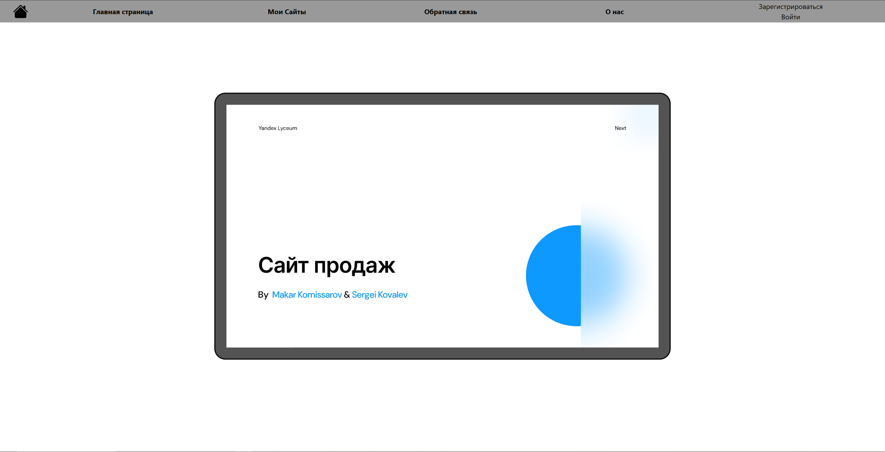
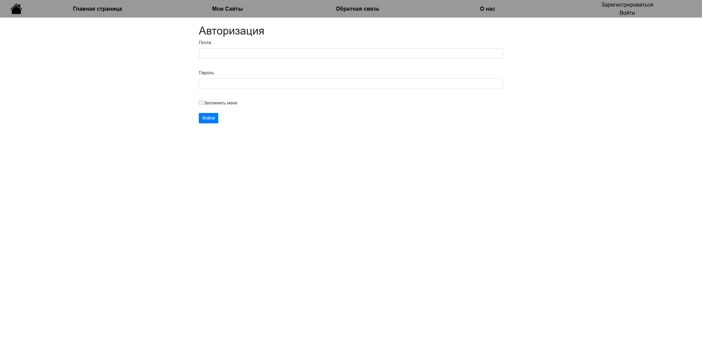

Сайт по продаже сайтов.
Проектом занимаются Макар К. и Сергей К.  

# Site for Selling Sites #  

Сайт, предоставляющий услугу пользователю создания сайта. Пользователю будут презентованы шаблоны некоторых сайтов,
относительно которых покупатель сможет сделать выбор - подходит ли такой вариант сайта для него, или нет. 
*Сайт написан на Flask.* 

###Описание ###  
- На всех страницах сайта сверху будет расположена навигационная панель, благодаря
которой пользователь сможет удобно перемещаться между страницами сайта.
- На первой странице сайта будет расположена презентация этого сайта.
(её пока нет, но к сдаче проекта она появится)

- На главной странице сайта будут расположены виджеты,
каждый из которых будет представлять какой-то определенный вид сайта.

- Также на сайте будут такие страницы как: страница с "Моими сайтами" (в ней пользователь
сможет просмотреть все свои купленные сайты: в какой стадии разработки находятся,
как на данный момент работают и выглядят), страница с "Обратной связью" (в ней пользователь
сможет задачать вопросы чат-боту нашего сайта, или задать вопросы разработчику по конкретному купленному сайту)
- На сайте реализована работа с аккаунтами пользователей:
1) Регистрация
  
2) Авторизация
  
- У каждого пользователя есть свой личный кабинет, где он может просмотреть личную информацию.
  
- Реализована работа с базой данных, в которой хранятся данные о пользователях, а также имя их личного каталога
на сервере, в котором хранятся данные их сайтов.
- Пользователь в любой момент может просмотреть в каком состоянии находится его сайт:
на каком этапе разработки он находится и как он работает и выглядит.
(Пользователь может непосредственно запустить свой сайт и проверить его работоспособность)
- У разработчика же есть возможность обновлять файлы каждого проекта пользователей.

 

### Технологии в проекте ###

Приложение написано на языке программирования Python c использованием следующих библиотек:
1) Flask
2) WTForms
3) Flask-Login
4) Werkzeug
5) SQLAlchemy
А также еще со встроенными библиотеками.

**App** - переменная, отвечающая за работу сайта.

**Файл main** - главный файл веб-приложения.

**Файл users** - файл, хранящий модель пользователя для базы данных.

**Файл users_files** - файл, хранящий модель таблицы базы данных, в которой хранятся данные проектах пользователя и его 
личного каталога.

**Файл all_models** - хранит данные о всех моделях базы данных.

**Файл db_session** - файл, необходимый для работы с базой данных.

**Файл user** - файл, хранящий данные о формах для заполнения данных пользователя при регистрации/авторизации.

### Техническое описание проекта ###
Для запуска приложения необходимо запустить main.py  

Чтобы установить все зависимости (Flask, WTForms, Flask-Login, Werkzeug, SQLAlchemy) 
достаточно в консоли (терминале) вызвать команду  
pip install -r requirements.txt